AKS HOL - Basic to Advanced

## Introduction

## Purpose

## What to Accomplish

- ### Understand K8s High Level Architecture

- ### Understand AKS High Level Architecture

- ### Create AKS Cluster

- ### Deploy Microservices

- ### Cluster Configuration - Post Creation

- ### Maintenance


## Exclusions

- Enhanced Control of K8s cluster
  - K8s REST API
  - Admission Webhook; Validation Webhook
- Integration with APIM
- Integration with DevOps
- GitOps

## Implementation

- [**Understand K8s High Level Architecture**](#Understand K8s High Level Architecture)

  

- [**Understand AKS High Level Architecture**](#Understand AKS High Level Architecture)

  

  - **AKS Baseline architecture**

    

  - **Ancilliary components of AKS cluster**

    ```bash
    #Local Variables
    
    tenantId=""
    subscriptionId=""
    aksResourceGroup=""
    masterResourceGroup=""
    location=""
    clusterName=""
    version=""
    acrName=""
    acrId=
    keyVaultName=""
    keyvaultId=
    objectId=
    masterVnetName=""
    masterVnetId=
    aksVnetName=""
    aksVnetPrefix=""
    aksVnetId=
    aksSubnetName=""
    aksSubnetPrefix=""
    aksSubnetId=
    aksIngressSubnetName=""
    aksIngressSubnetPrefix=""
    aksIngressSubnetId=
    aksAppgwName=""
    aksAppgwSubnetName=""
    aksAppgwSubnetPrefix=""
    aksAppgwSubnetId=
    sysNodeSize="Standard_DS3_v2"
    sysNodeCount=3
    maxSysPods=30
    networkPlugin=azure
    networkPolicy=azure
    sysNodePoolName=akssyspool
    ingressNodePoolName=apisyspool
    vmSetType=VirtualMachineScaleSets
    addons=monitoring
    aadAdminGroupID=""
    aadTenantID=""
    spAppId=""
    spPassword=""
    masterAKSPeering="$masterVnetName-$aksVnetName-peering"
    aksMasterPeering="$aksVnetName-$masterVnetName-peering"
    masterAKSPrivateDNSLink="$masterVnetName-aks-dns-link"
    aksPrivateDNSLink="$aksVnetName-dns-link"
    aksIngControllerName=""
    aksIngControllerNSName=""
    aksIngControllerFileName="internal-ingress"
    privateDNSZoneName=""
    privateDNSZoneId=
    httpsListenerNames='("dev","qa")'
    backendIpAddress=
    ```

    

    - Login to Azure

      ```bash
      #Login to Azure
      az login --tenant $tenantId
      
      #Check Selected Subscription
      az account show
      
      #Set appropriate Subscription, if needed
      #az account set -s $subscriptionId
      ```

      

    - Service Principal

      ```bash
      #Create Service Principal
      az ad sp create-for-rbac --skip-assignment -n https://aks-train-sp
      {
        "appId": "",
        "displayName": "https://arc-aks-sp",
        "name": "",
        "password": "",
        "tenant": ""
      }
      
      #Create Service Principal
      az ad sp create-for-rbac --skip-assignment -n https://aks-train-sp
      {
        "appId": "",
        "displayName": "https://arc-aks-sp",
        "name": "",
        "password": "",
        "tenant": ""
      }
      
      #Set Service Principal variables
      spAppId=""
      spPassword=""
      ```

      

    - Resource Group

      ```bash
      #Create Resource Group for AKS workloads
      az group create -n $aksResourceGroup -l $location
      ```

      

    - Virtual Network

      - Azure CNI

      

      - Hub

        ```bash
        #Deploy Hub Virtual Network
        az network vnet create -n $masterVnetName -g $masterResourceGroup --address-prefixes $masterVnetPrefix
        masterVnetId=$(az network vnet show -n $masterVnetName -g $masterResourceGroup --query="id" -o tsv)
        echo $masterVnetId
        
        #Deploy Jump Server Subnet inside Hub Virtual Network
        az network vnet subnet create -n $masterSubnetName --vnet-name $masterVnetName -g $masterResourceGroup --address-prefixes $masterSubnetPrefix
        masterSubnetId=$(az network vnet subnet show -n $masterSubnetName --vnet-name $masterVnetName -g $masterResourceGroup --query="id" -o tsv)
        echo $masterSubnetId
        ```

        

      - Spoke

        ```bash
        #Deploy Spoke Virtual Network
        az network vnet create -n $aksVnetName -g $aksResourceGroup --address-prefixes $aksVnetPrefix
        aksVnetId=$(az network vnet show -n $aksVnetName -g $aksResourceGroup --query="id" -o tsv)
        echo $aksVnetId
        
        #Deploy AKS Subnet inside Spoke Virtual Network
        az network vnet subnet create -n $aksSubnetName --vnet-name $aksVnetName -g $aksResourceGroup --address-prefixes $aksSubnetPrefix
        aksSubnetId=$(az network vnet subnet show -n $aksSubnetName --vnet-name $aksVnetName -g $aksResourceGroup --query="id" -o tsv)
        echo $aksSubnetId
        
        #Deploy Ingress Subnet inside Spoke Virtual Network
        az network vnet subnet create -n $aksIngressSubnetName --vnet-name $aksVnetName -g $aksResourceGroup --address-prefixes $aksIngressSubnetPrefix
        aksIngressSubnetId=$(az network vnet subnet show -n $aksIngressSubnetName --vnet-name $aksVnetName -g $aksResourceGroup --query="id" -o tsv)
        echo $aksIngressSubnetId
        
        #Deploy Aplication Gateway Subnet inside Spoke Virtual Network
        az network vnet subnet create -n $aksAppgwSubnetName --vnet-name $aksVnetName -g $aksResourceGroup --address-prefixes $aksAppgwSubnetPrefix
        aksAppgwSubnetId=$(az network vnet subnet show -n $aksAppgwSubnetName --vnet-name $aksVnetName -g $aksResourceGroup --query="id" -o tsv)
        echo $aksAppgwSubnetId
        ```

      - Role Assignment

        ```bash
        #Assign Role to Spoke Virtual Network
        az role assignment create --assignee $spAppId --role "Network Contributor" --scope $aksVnetId
        ```

    - Azure Container Registry

      ```bash
      #Deploy ACR
      az acr create -n $acrName -g $aksResourceGroup --sku STANDARD --admin-enabled false
      acrId=$(az acr show -n $acrName -g $aksResourceGroup --query="id" -o tsv)
      echo $acrId
      
      #Assign Role to Service Principal for the ACR
      az role assignment create --assignee $spAppId --role "AcrPull" --scope $acrId
      ```

      

    - Key Vault

      ```bash
      #Deploy KeyVault
      az keyvault create -n $capzKeyVaultName -g $capzResourceGroup --sku Standard
      objectId=$(az ad user show --id modatta@microsoft.com --query="objectId" -o tsv)
      
      #Set Access Policy to KeyVault for the loged in User 
      az keyvault set-policy -n $keyVaultName -g $aksResourceGroup --key-permissions get list update create delete \
      --secret-permissions get list set delete --certificate-permissions get list update create delete \
      --object-id $objectId
      keyvaultId=$(az keyvault show -n $keyVaultName -g $aksResourceGroup --query="id" -o tsv)
      ```

      

- [**Create AKS Cluster**](#Create AKS Cluster)

  - Isolation

    - Physical

      

      

    - Logical

      

  - Cluster Creation

    ```bash
    #Create Public AKS cluster
    az aks create --name $clusterName \
    --resource-group $aksResourceGroup \
    --kubernetes-version $version --location $location \
    --vnet-subnet-id "$aksSubnetId" --enable-addons $addons \
    --node-vm-size $sysNodeSize \
    --node-count $sysNodeCount --max-pods $maxSysPods \
    --service-principal $spAppId \
    --client-secret $spPassword \
    --network-plugin $networkPlugin --network-policy $networkPolicy \
    --nodepool-name $sysNodePoolName --vm-set-type $vmSetType \
    --generate-ssh-keys \
    --enable-aad \
    --aad-admin-group-object-ids $aadAdminGroupID \
    --aad-tenant-id $aadTenantID \
    --attach-acr $acrName
    ```

  - Authentication

    ```bash
    #Connect to AKS cluster and check status
    az aks get-credentials -g $aksResourceGroup --name $clusterName --admin --overwrite
    kubectl get ns
    
    #Connect to AKS cluster as Admin
    az aks get-credentials -g $resourceGroup -n $clusterName --admin
    ```

  - Nodepool Creation

    ```bash
    #Create Additional Nodepool
    az aks nodepool add --cluster-name $clusterName --resource-group $aksResourceGroup \
    --name $apiNodePoolName --kubernetes-version $version --max-pods $maxPods \
    --node-count $nodeCount --node-vm-size $nodePoolVMSize --os-type $osType \
    --mode User
    ```

    

  - AutoScaling

    

    - System Nodepool

      ```bash
      #Update System nodepool with AutoScaling
      az aks nodepool update --cluster-name $clusterName --resource-group $aksResourceGroup \
      --enable-cluster-autoscaler --min-count $minNodeCount --max-count $maxNodeCount \
      --name $sysNodePoolName
      ```

    - API Nodepool

      ```bash
      #Update API nodepool with AutoScaling
      az aks nodepool update --cluster-name $clusterName --resource-group $aksResourceGroup \
      --enable-cluster-autoscaler --min-count $minNodeCount --max-count $maxNodeCount \
      --name $apiNodePoolName
      ```

      

  - Authorization

    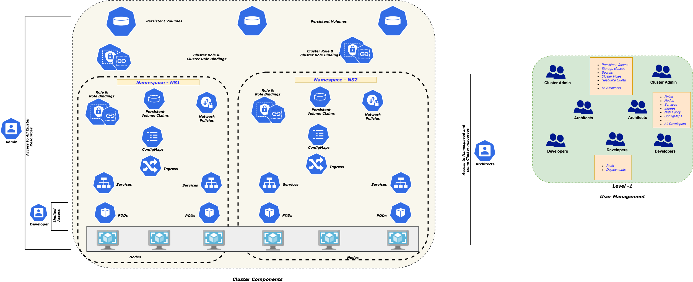

    

    - Azure AD; RBAC

      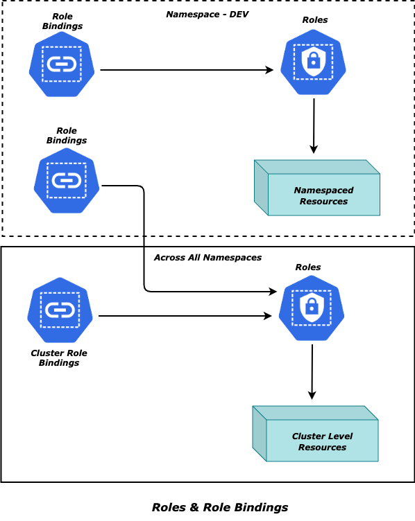

      ```bash
      # RBAC using Helm chart
      helm create rbac-chart
      
      helm install rbac-chart -n dev ./rbac-chart/ -f ./rbac-chart/values-dev.yaml
      helm upgrade rbac-chart -n dev ./rbac-chart/ -f ./rbac-chart/values-dev.yaml
      
      helm install rbac-chart -n qa ./rbac-chart/ -f ./rbac-chart/values-qa.yaml
      helm upgrade rbac-chart -n qa ./rbac-chart/ -f ./rbac-chart/values-qa.yaml
      
      helm install smoke-chart -n smoke ./rbac-chart/ -f ./rbac-chart/values-smoke.yaml
      helm upgrade smoke-chart -n smoke ./rbac-chart/ -f ./rbac-chart/values-smoke.yaml
      ```

    - cluster-admin.yaml

      ```
      {{if not (lookup "rbac.authorization.k8s.io/v1" "ClusterRoleBinding" "" "<>") }}
      apiVersion: rbac.authorization.k8s.io/v1
      kind: ClusterRoleBinding
      metadata:
        name: {{ .Values.clusteradmin.name }}
      roleRef:
        apiGroup: rbac.authorization.k8s.io
        kind: ClusterRole
        name: {{ .Values.clusteradmin.roleName }}
      subjects:
      - apiGroup: rbac.authorization.k8s.io
        name: {{ (index .Values.clusteradmin.subjects 0).name}}
        kind: {{ (index .Values.clusteradmin.subjects 0).kind}}
      {{ end }}
      
      
      ```

      

    - developer.yaml

      ```yaml
      apiVersion: rbac.authorization.k8s.io/v1
      kind: Role
      metadata:
        name: {{ .Values.developer.roleName }}
        namespace: {{ .Values.developer.roleNamespace }}
      rules:
      {{- range $rule := .Values.developer.rules}}
      - apiGroups: {{ $rule.apiGroups }}
        resources: {{ $rule.resources }}
        verbs: {{ $rule.verbs }}
      {{- end }}
      
      ---
      apiVersion: rbac.authorization.k8s.io/v1
      kind: RoleBinding
      metadata:
        name: {{ .Values.developer.bindingName }}
        namespace: {{ .Values.developer.bindingNamespace }}
      roleRef:
        apiGroup: rbac.authorization.k8s.io
        kind: Role
        name: {{ .Values.developer.roleName }}
      subjects:
      {{- range $subject := .Values.developer.subjects}}
      - apiGroup: rbac.authorization.k8s.io
        name: {{  $subject.name }}
        kind: {{  $subject.kind }}
      {{- end }}
      ```

      

    - manager.yaml

      ```yaml
      apiVersion: rbac.authorization.k8s.io/v1
      kind: Role
      metadata:
        name: {{ .Values.manager.roleName }}
        namespace: {{ .Values.manager.roleNamespace }}
      rules:
      {{- range $rule := .Values.developer.rules}}
      - apiGroups: {{ $rule.apiGroups }}
        resources: {{ $rule.resources }}
        verbs: {{ $rule.verbs }}
      {{- end }}
      
      ---
      apiVersion: rbac.authorization.k8s.io/v1
      kind: RoleBinding
      metadata:
        name: {{ .Values.manager.bindingName }}
        namespace: {{ .Values.manager.bindingNamespace }}
      roleRef:
        apiGroup: rbac.authorization.k8s.io
        kind: Role
        name: {{ .Values.manager.roleName }}
      subjects:
      {{- range $subject := .Values.manager.subjects}}
      - apiGroup: rbac.authorization.k8s.io
        name: {{ $subject.name }}
        kind: {{ $subject.kind }}
      {{- end }}
      
      ```

      

    - values-dev.yaml

      ```yaml
      clusteradmin:
        name: <>
        roleName: cluster-admin
        subjects:
        - name: <>
          kind: User
      
      developer:
        roleName: <>
        roleNamespace: dev
        rules:
        - apiGroups: ["", "apps", "networking.k8s.io"]
          resources: ["configmaps", "pods", "pods/exec", "pods/log", "deployments", "services", "events", "ingresses"]
          verbs: ["create", "delete", "deletecollection", "get", "list", "patch", "update", "watch"]
        bindingName: <>
        bindingNamespace: dev
        subjects:
        - name: <>
          kind: Group
      
      manager:
        roleName: <>
        roleNamespace: dev
        rules:
        - apiGroups: ["", "apiextensions.k8s.io", "apps", "autoscaling", "batch", "events.k8s.io", "networking.k8s.io", "policy", "rbac.authorization.k8s.io", "scheduling.k8s.io"]
          resources: ["configmaps", "endpoints", "events", "limitranges", "persistentvolumeclaims", "pods", "resourcequotas", "serviceaccounts", "namespaces", "services", "customresourcedefinitions", "daemonsets", "deployments", "replicasets", "statefulsets", "horizontalpodautoscalers", "cronjobs", "jobs", "events", "ingresses", "networkpolicies", "poddisruptionbudgets", "rolebindings", "roles", "priorityclasses"]
          verbs: ["create", "delete", "deletecollection", "get", "list", "patch", "update", "watch"]
        - apiGroups: ["metrics.k8s.io"]
          resources: ["nodes", "pods"]
          verbs: ["get", "list"]
        bindingName: <>
        bindingNamespace: dev
        subjects:
        - name: <>
          kind: Group
      
      ```

      

    - values-qa.yaml

      ```yaml
      clusteradmin:
        name: <>
        roleName: cluster-admin
        subjects:
        - name: <>
          kind: User
      
      developer:
        roleName: <>
        roleNamespace: qa
        rules:
        - apiGroups: ["", "apps", "networking.k8s.io"]
          resources: ["configmaps", "pods", "pods/exec", "pods/log", "deployments", "services", "events", "ingresses"]
          verbs: ["create", "delete", "deletecollection", "get", "list", "patch", "update", "watch"]
        bindingName: <>
        bindingNamespace: qa
        subjects:
        - name: <>
          kind: Group
      
      manager:
        roleName: <>
        roleNamespace: qa
        rules:
        - apiGroups: ["", "apiextensions.k8s.io", "apps", "autoscaling", "batch", "events.k8s.io", "networking.k8s.io", "policy", "rbac.authorization.k8s.io", "scheduling.k8s.io"]
          resources: ["configmaps", "endpoints", "events", "limitranges", "persistentvolumeclaims", "pods", "resourcequotas", "serviceaccounts", "namespaces", "services", "customresourcedefinitions", "daemonsets", "deployments", "replicasets", "statefulsets", "horizontalpodautoscalers", "cronjobs", "jobs", "events", "ingresses", "networkpolicies", "poddisruptionbudgets", "rolebindings", "roles", "priorityclasses"]
          verbs: ["create", "delete", "deletecollection", "get", "list", "patch", "update", "watch"]
        - apiGroups: ["metrics.k8s.io"]
          resources: ["nodes", "pods"]
          verbs: ["get", "list"]
        bindingName: <>
        bindingNamespace: qa
        subjects:
        - name: <>
          kind: Group
      
      ```

    -  values-smoke.yaml

      ```yaml
      clusteradmin:
        name: <>
        roleName: cluster-admin
        subjects:
        - name: <>
          kind: User
      
      developer:
        roleName: <>
        roleNamespace: smoke
        rules:
        - apiGroups: ["", "apps", "networking.k8s.io"]
          resources: ["configmaps", "pods", "pods/exec", "pods/log", "deployments", "services", "events", "ingresses"]
          verbs: ["create", "delete", "deletecollection", "get", "list", "patch", "update", "watch"]
        bindingName: <>
        bindingNamespace: smoke
        subjects:
        - name: <>
          kind: Group
      
      manager:
        roleName:<>
        roleNamespace: smoke
        rules:
        - apiGroups: ["*"]
          resources: ["*"]
          verbs: ["*"]
        - apiGroups: ["metrics.k8s.io"]
          resources: ["nodes", "pods"]
          verbs: ["get", "list"]
        bindingName: <>
        bindingNamespace: smoke
        subjects:
        - name: <>
          kind: Group
      
      ```

      

- [**Cluster Configuration - Post Creation**](#Cluster Configuration - Post Creation)

  - Install Nginx Ingress as *Internal LoadBalancer*

    ```bash
    #Create Ingress Namespace
    kubectl create namespace $aksIngControllerNSName
    kubectl label namespace $aksIngControllerNSName name=$aksIngControllerNSName
    
    # Install nginx as ILB using Helm
    helm repo add ingress-nginx https://kubernetes.github.io/ingress-nginx
    helm repo update
    
    #Install Ingress controller
    helm install $aksIngControllerName ingress-nginx/ingress-nginx --namespace $aksIngControllerNSName \
    -f $ingControllerFilePath \
    --set controller.service.loadBalancerIP=$backendIpAddress \
    --set controller.nodeSelector.agentpool=$sysNodePoolName \
    --set controller.defaultBackend.nodeSelector.agentpool=$sysNodePoolName \
    --set controller.service.annotations.'service\.beta\.kubernetes\.io/azure-load-balancer-internal-subnet'=$aksIngressSubnetName
    ```

  - Deploy K8s Ingress

    - ingress.yaml

      ```yaml
      {{ $ingress := .Values.ingress }}
      apiVersion: networking.k8s.io/v1
      kind: Ingress
      metadata:
        name: {{ $ingress.name }}    
        namespace: {{ $ingress.namespace }}  
        annotations:
          kubernetes.io/ingress.class: {{ $ingress.annotations.ingressClass }}
          {{ if $ingress.annotations.rewriteTarget }}
          nginx.ingress.kubernetes.io/rewrite-target: {{ $ingress.annotations.rewriteTarget }}
          {{ end }}  
          {{ if $ingress.annotations.enableCors }}
          nginx.ingress.kubernetes.io/enable-cors: {{ $ingress.annotations.enableCors | quote }}
          {{ end }}  
          {{ if $ingress.annotations.proxyBodySize }}
          nginx.ingress.kubernetes.io/proxy-body-size: {{ $ingress.annotations.proxyBodySize }}
          {{ end }}
          {{ if $ingress.annotations.backendProtocol }}
          nginx.ingress.kubernetes.io/backend-protocol: {{ $ingress.annotations.backendProtocol }}
          {{ end }}
          {{ if $ingress.annotations.sslpassThrough }}
          nginx.ingress.kubernetes.io/ssl-passthrough: {{ $ingress.annotations.sslpassThrough | quote }}
          {{ end }}    
      spec:
        rules:
        {{- range $host := $ingress.hosts }}
        - host: {{ $host.name}}
          http:
            paths:
            {{- range $path := $host.paths }}
            - path: {{ $path.path }}
              pathType: {{ $path.pathType }}
              backend:
                service:
                  name: {{ $path.service }}
                  port:
                    number: {{ $path.port }}
            {{- end }}
        {{- end }}
        {{ if $ingress.tls }}
        tls:
        {{- range $tls := $ingress.tls }}
        - hosts:
          {{- range $tlsHost := $tls.hosts }}
          - {{ $tlsHost | quote }}
          {{- end }}
          secretName: {{ $tls.secretName }}
        {{- end }}
        {{ end }}
      ```

    - values-dev.yaml

      ```yaml
      ingress:
        name: aks-workshop-ingress
        namespace: aks-workshop-dev
        annotations:
          ingressClass: nginx
          proxyBodySize: "10m"
          enableCors: "true"
          rewriteTarget: /$1
        hosts:
        - name: dev.internal.wkshpdev.com
          paths:    
          - path: /?(.*)
            service: ratingsweb-service
            port: 80    
      ```

      

    - Values-qa.yaml

      ```yaml
      ingress:
        name: aks-workshop-ingress
        namespace: aks-workshop-qa
        annotations:
          ingressClass: nginx
          proxyBodySize: "10m"
          enableCors: "true"
          rewriteTarget: /$1
        hosts:
        - name: qa.internal.wkshpdev.com
          paths:
          - path: /?(.*)
            service: ratingsweb-service
            port: 80
      ```

      

    - values-smoke.yaml

      ```yaml
      ingress:
        name: smoke-ingress
        namespace: smoke
        annotations:
         ingressClass: nginx
         enableCors: "true"
         rewriteTarget: /$1
        hosts:
        - name: smoke.internal.wkshpdev.com
          paths:  
          - path: /healthz/?(.*)
            pathType: ImplementationSpecific
            service: nginx-svc
            port: 80    
      ```

      

  - Deploy Application Gateway

    ```bash
    #Deploy Application Gateway
    az deployment group create -f ./aksauto-appgw-deploy.bicep -g $aksResourceGroup \
    --parameters @./aksauto-appgw-deploy.parameters.json \
    --parameters applicationGatewayName=$aksAppgwName \
    vnetName=$aksVnetName subnetName=$aksAppgwSubnetName \
    httpsListenerNames=$httpsListenerNames \
    backendIpAddress=$backendIpAddress
    ```

    

    - Overview

      

      

    - Host headers

      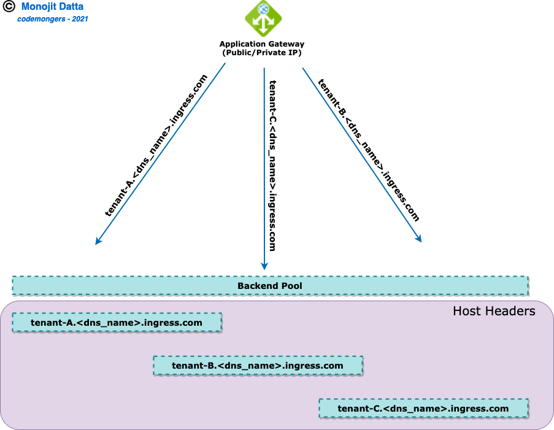

      

    - Overview

      

      

    - SSL/TLS

      - Offloading @Application Gateway

        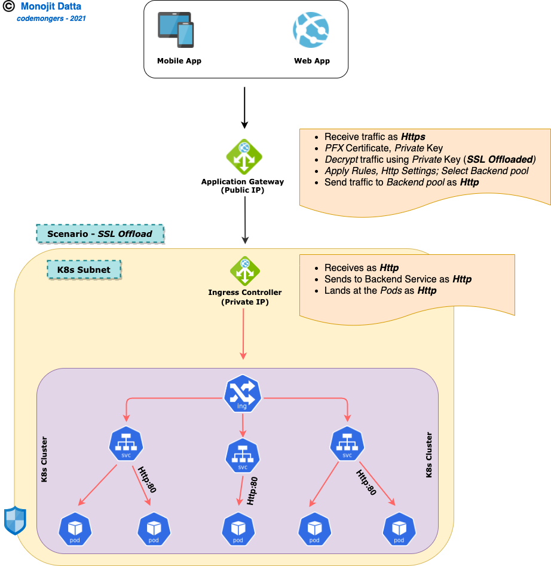

        - values-dev-tls.yaml

          ```yaml
          ingress:
            name: <>
            namespace: dev
            annotations:
              ingressClass: nginx
              proxyBodySize: "10m"
              enableCors: "true"
              rewriteTarget: /$1
            tls:
            - hosts:
              - "<>-dev.internal.dns.com"
              secretName: <>
            hosts:
            - name: <>-dev.internal.dns.com
              paths:
              - path: /?(.*)
                service: <>
                port: <>
            
          ```

          

        - values-qa-tls.yaml

          ```yaml
          ingress:
            name: <>
            namespace: dev
            annotations:
              ingressClass: nginx
              proxyBodySize: "10m"
              enableCors: "true"
              rewriteTarget: /$1
            tls:
            - hosts:
              - "<>-qa.internal.dns.com"
              secretName: <>
            hosts:
            - name: <>-qa.internal.dns.com
              paths:
              - path: /?(.*)
                service: <>
                port: <>
            
          ```

          

        - values-dev-smoke.yaml

          ```yaml
          ingress:
            name: <>
            namespace: dev
            annotations:
              ingressClass: nginx
              proxyBodySize: "10m"
              enableCors: "true"
              rewriteTarget: /$1
            tls:
            - hosts:
              - "<>-smoke.internal.dns.com"
              secretName: <>
            hosts:
            - name: <>-smoke.internal.dns.com
              paths:
              - path: /?(.*)
                service: <>
                port: <>
          ```

          

      - Backend protocol

        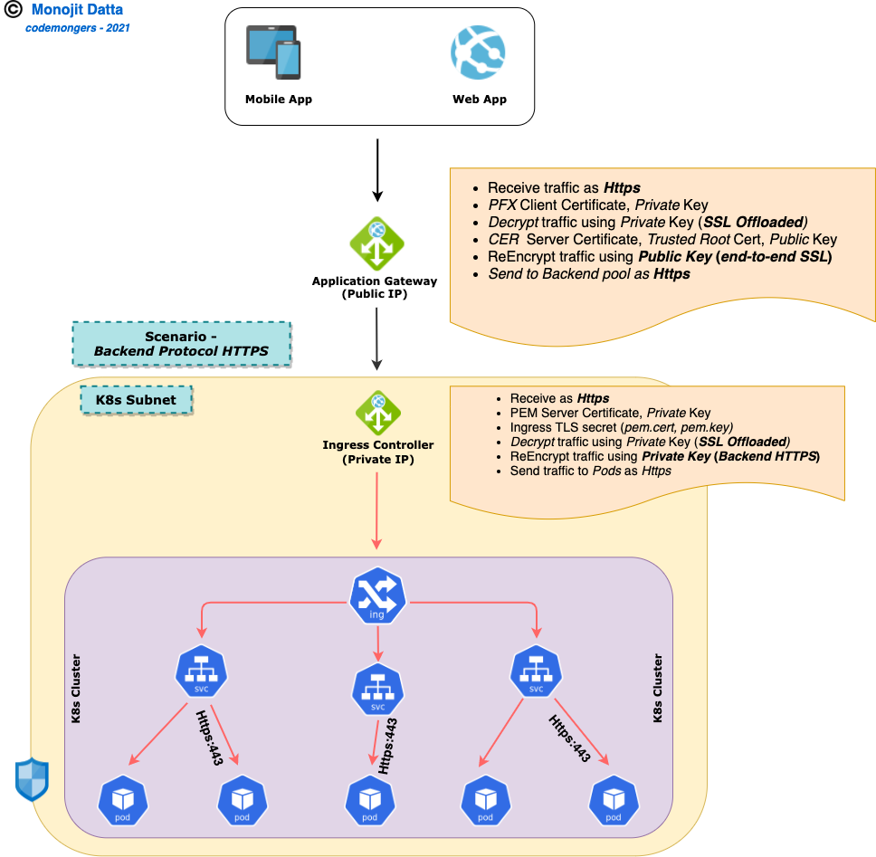

        - values-e2essl-backend.yaml

          ```yaml
          ingress:
            name: <>
            namespace: ssltest
            annotations:
              ingressClass: nginx
              proxyBodySize: "10m"
              enableCors: "true"
              rewriteTarget: /$1
              backendProtocol: "HTTPS"
            tls:
            - hosts:
              - "*.internal.dns.com"
              secretName: aks-workshop-tls-secret
            hosts:
            - name: <>.internal.dns.com
              paths:
              - path: /?(.*)
                service: <>
                port: 443 
            - name: <>.internal.dns.com
              paths:
              - path: /?(.*)
                service: <>
                port: 443    
          ```

          

      - PasThru

        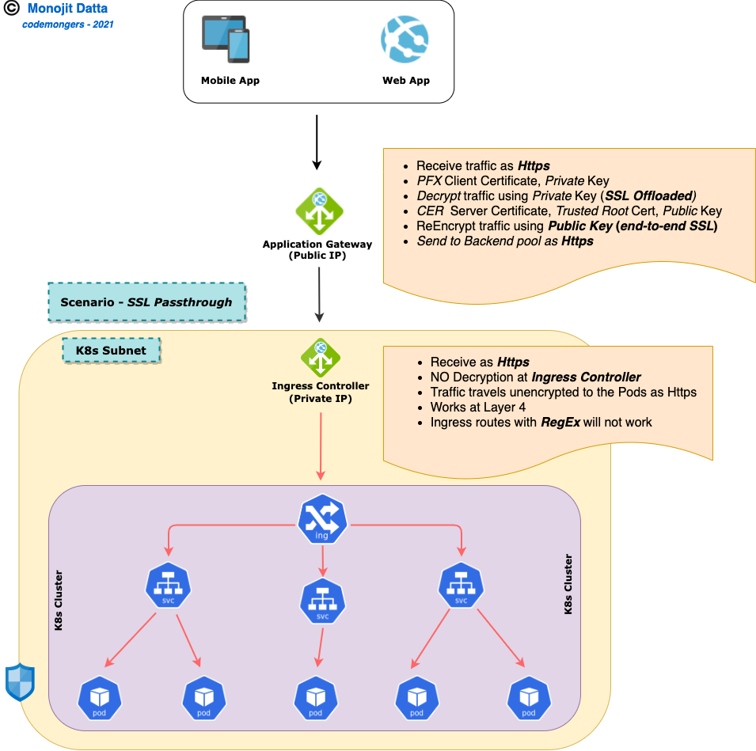

        

        - values-e2essl-passthru.yaml

          ```yaml
          ingress:
            name: <>
            namespace: ssltest
            annotations:
              ingressClass: nginx
              proxyBodySize: "10m"
              enableCors: "true"
              sslpassThrough: "true"
            hosts:
            - name: <>.internal.dns.com
              paths:
              - path: /
                service: api-proxy-svc
                port: 443
              - path: /api/post
                service: api-proxy-svc
                port: 443
              - path: /bkend
                service: api-proxy-svc
                port: 443
              - path: /api/post/bkend
                service: api-proxy-svc
                port: 443
            - name: <>.internal.dns.com
              paths:
              - path: /
                service: api-bkend-svc
                port: 443
              - path: /api/post
                service: api-bkend-svc
                port: 443    
          ```

          

    - Lock down access to Microservices within the Cluster 

      - Network Policies

        ```yaml
        kind: NetworkPolicy
        apiVersion: networking.k8s.io/v1
        metadata:
          name: {{ (index .Values.netpols 0).name }}
          namespace: {{ (index .Values.netpols 0).namespace }}
        spec:
          podSelector:
            matchLabels:
            {{ toYaml (index .Values.netpols 0).podLabels | nindent 6 }}
          policyTypes:
          {{ toYaml (index .Values.netpols 0).policyTypes | nindent 2 }}
          ingress:
          {{ $ingresses := (index .Values.netpols 0).ingresses }}
          {{ $ingress := (index $ingresses 0) }}
          - from:
            - namespaceSelector:
                matchLabels:
                  name: {{ (index $ingress.namespaceLabels 0) }}
            - podSelector:
                matchLabels:
                  app: {{ (index $ingress.podLabels 0) }}
            - podSelector:
                matchLabels:
                  app: {{ (index $ingress.podLabels 1) }}
            ports:
            - protocol: TCP
              port: {{ (index $ingress.ports 0) }}
          {{ $ingress := (index $ingresses 1) }}
          - from:
            - ipBlock:
                cidr: {{ (index $ingress.ipBlocks 0) }}
            - namespaceSelector:
                matchLabels:
                  name: {{ (index $ingress.namespaceLabels 0) }}
            - podSelector:
                matchLabels:
                  app.kubernetes.io/name: {{ (index $ingress.podLabels 0) }}
        
        ```

      - values-dev.yaml

        ```yaml
        [TBD]
        ```

      - values-qa.yaml

        ```
        [TBD]
        ```

        

- [**Deploy Microservices**](#Deploy Microservices)

  - **Deployment**

    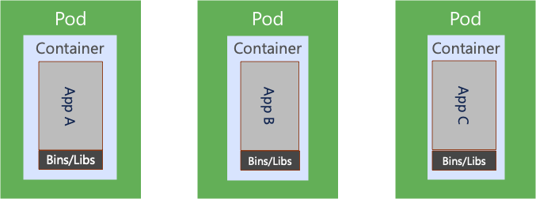

    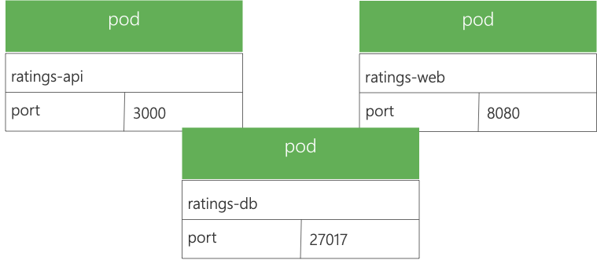

    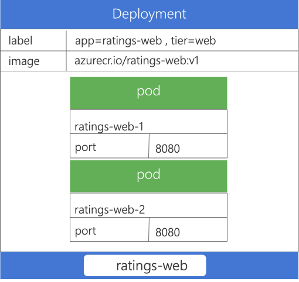

    - Versioning

      ```
      [TBD]
      ```

      

    - Node Affinity/Anti-Affnity

      ```
      [TBD]
      ```

      

    - Pod Affinity/Anti-Affnity

      ```
      [TBD]
      ```

      

    - Pod DIsruption Budget (*PDB*)

      ```
      [TBD]
      ```

      

  - **Service**

    - Why

      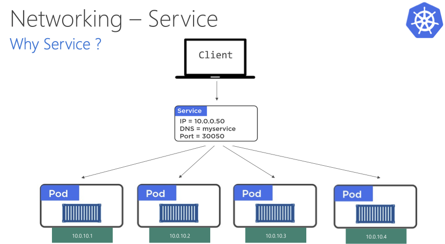

    

    - How

      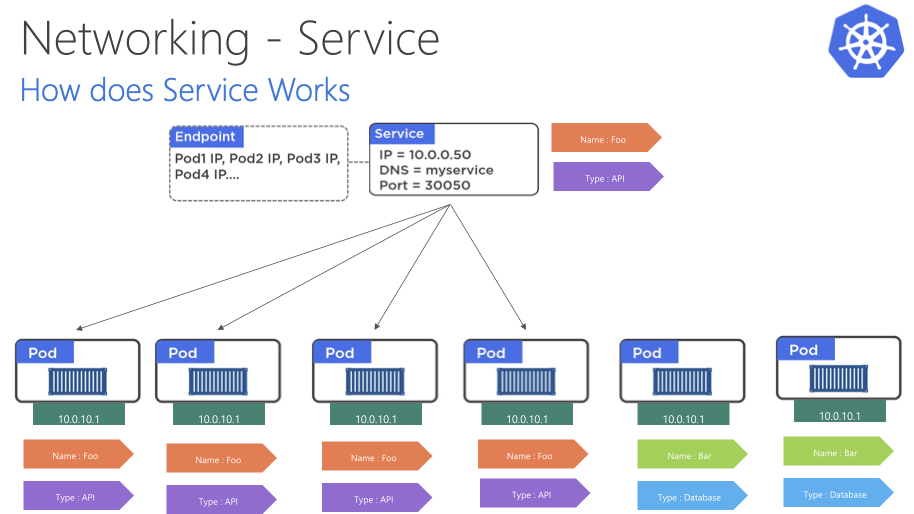

      

    - ratings-app-svc.png

      

    

    - External Ingress

      

      

      

      - LoadBalancer

      

      ```
      [TBD]
      ```

      

      - Nodeport

        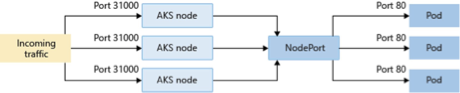

    - Internal Ingress

      - ClusterIP

      

      ```
      [TBD]
      ```

      

      

    - Network Policy - *East/West Security*

      

      ```
      [TBD]
      ```

      

  - **Persistent Storage**

    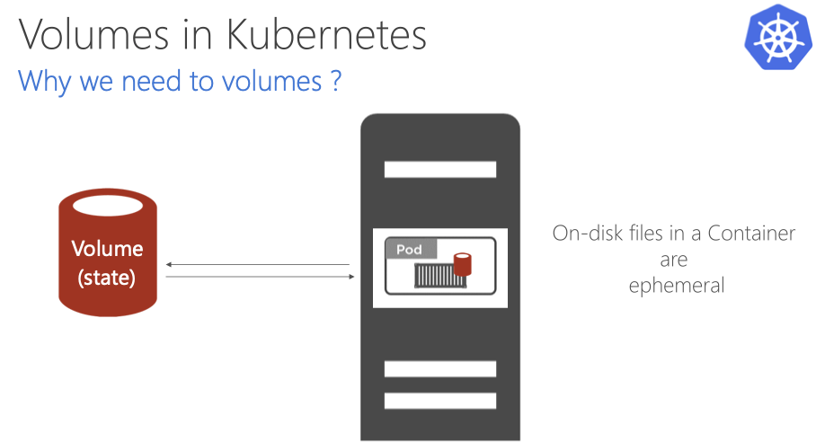

    

    - PeristentVolume

      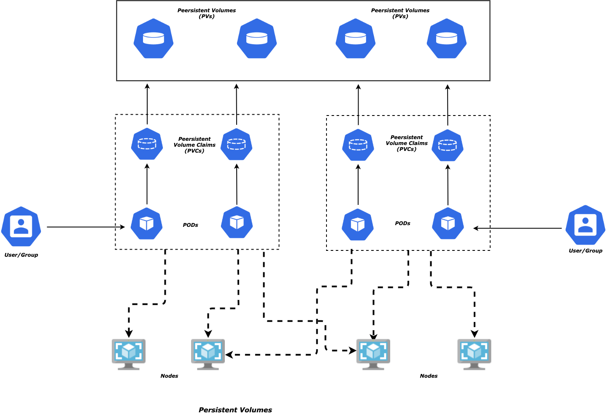

      

    - PeristentVolumeCaim

      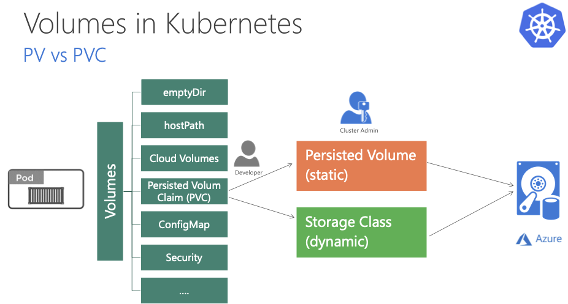

      

      - Persistence with Azure File

        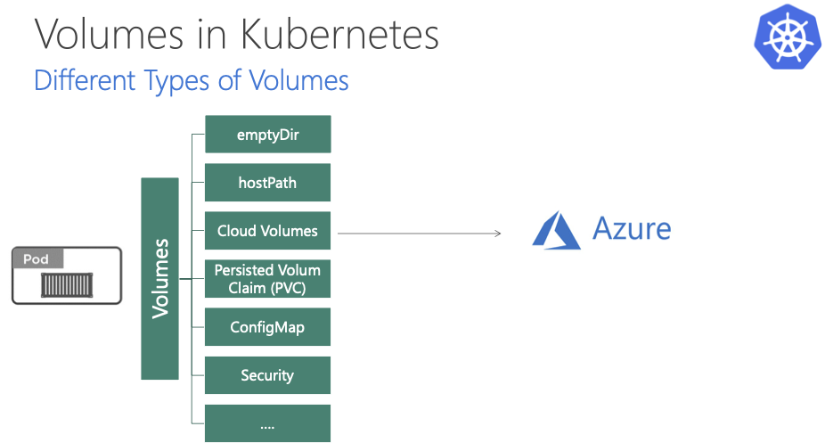

        

      - Persistence with Azure Disk

        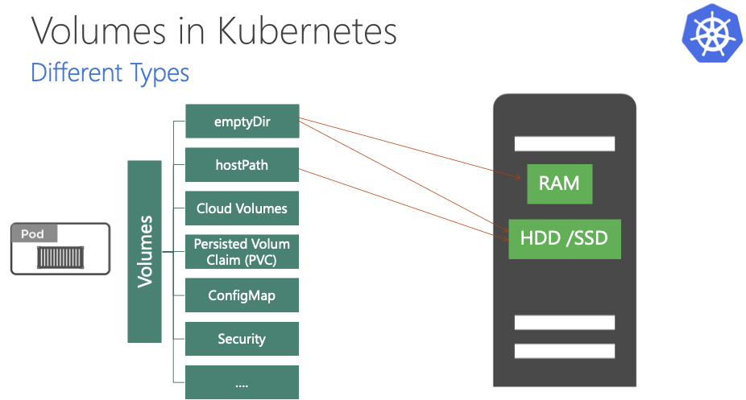

- [**Maintenance**](#Maintenance)

  - Monitoring

    - Azure Monitor

    - Azure Log Analytics

      ```bash
      #Azure Monitor with Prometheus
      https://docs.microsoft.com/en-us/azure/azure-monitor/containers/container-insights-prometheus-integration#configure-and-deploy-configmaps
      
      #Prometheus config map
      https://aka.ms/container-azm-ms-agentconfig
      ```

      

    - Load Testing 
      - JMeter Cluster
      
        
      
        ```bash
        #JMeter Aks cluster Load testing
        https://techcommunity.microsoft.com/t5/azure-global/scalable-apache-jmeter-test-framework-using-azure-kubernetes/ba-p/1197379
        ```
      
        

  - Cluster Upgrades

  - Cleanup

    ```bash
    #Cleanup resources - Individual
    
    #az aks delete -g $aksResourceGroup -n $clusterName --yes
    #az acr delete -g $aksResourceGroup -n $acrName --yes
    #az keyvault delete -g $aksResourceGroup -n $keyVaultName --yes
    #az network application-gateway delete -g $aksResourceGroup -n $aksVnetName --yes
    #az network vnet delete -g $aksResourceGroup -n $aksVnetName --yes
    
    #Cleanup resources - All
    
    #az group delete -n $aksResourceGroup --yes
    ```

    


## Final Goal

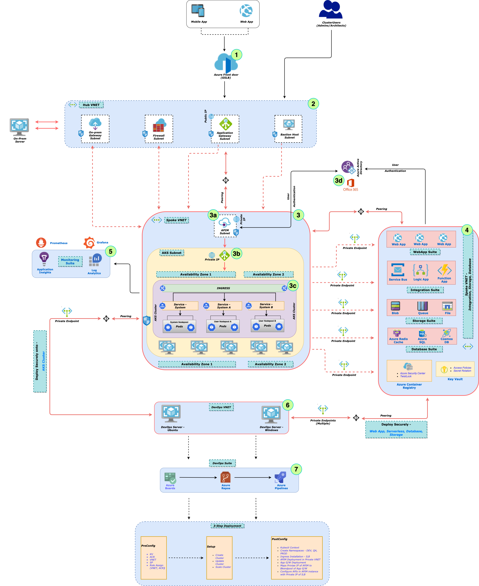


## References

